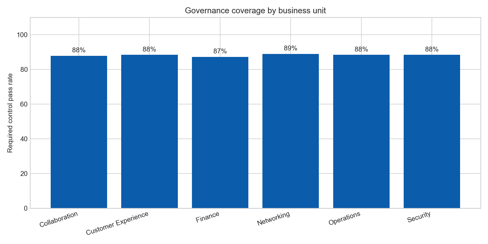
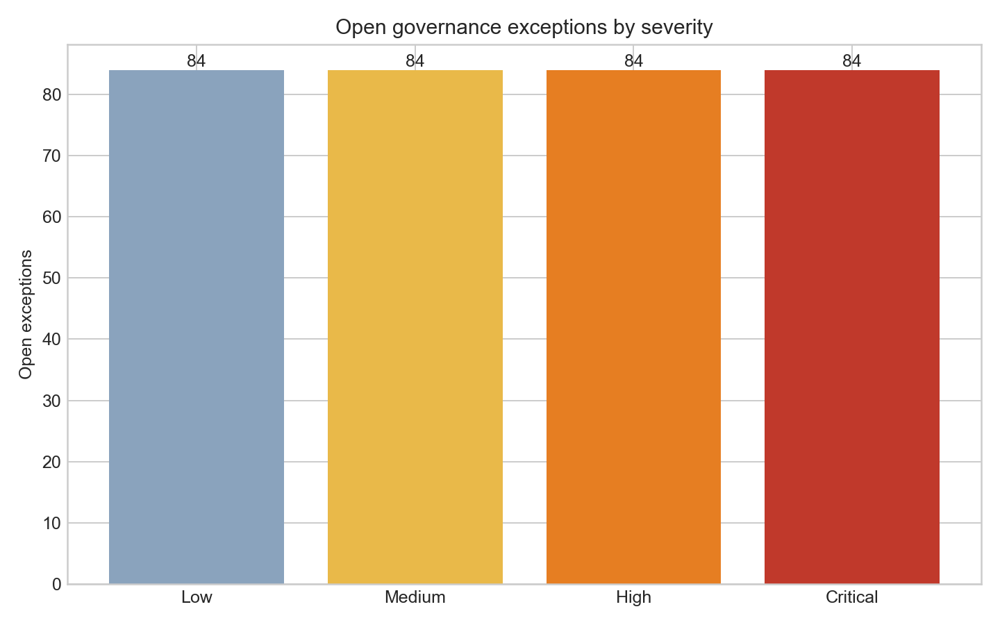

# Enterprise AI Governance Measurement Atlas

## Motivation

Enterprise AI programs need a shared operating view: where initiatives are being adopted, whether required controls are operating, where exceptions are aging, and whether planned value is becoming realized value. Without that view, executive governance can mistake activity for scale or value.

## What this project is

A reproducible Python analysis workbench that joins an AI initiative registry, control assessments, exception operations, adoption telemetry, and value-realization records into an executive measurement pack. It is designed as an analytical evidence base—not a generic dashboard—for a governance team deciding what to scale, remediate, or measure differently.

## Why this problem matters

Portfolio owners need to connect adoption with trustworthy data, accountable controls, risk operations, and business outcomes. A high workflow-run count should not conceal missing lineage evidence or aging critical exceptions.

## Data or evidence used

The five source-style CSV tables are deterministic synthetic data, explicitly created for this public demonstration because a public dataset does not safely provide linked enterprise AI-use-case, control, exception, adoption, and value records. They model 1,800+ records across 180 initiatives; they do not describe Cisco systems, customers, or performance.

| Table | Grain | Rows |
| --- | --- | ---: |
| `ai_initiative_registry.csv` | registered initiative | 180 |
| `control_assessments.csv` | initiative-control assessment | 1,080 |
| `governance_exceptions.csv` | exception case | 420 |
| `adoption_telemetry.csv` | initiative-week telemetry | 720 |
| `value_realization.csv` | initiative-quarter value record | 300 |

See [data_dictionary.md](data_dictionary.md) for definitions and assumptions.

## How the project works

1. `scripts/generate_data.py` creates deterministic source-style tables.
2. `scripts/analyze_portfolio.py` derives control coverage, value realization, exception-aging, and remediation-priority outputs.
3. The script writes inspectable CSV outputs and rendered charts used in this README.

## Outputs and views

**Governance coverage by business unit** — directs leaders toward units where required-control evidence needs reinforcement before scaled deployment.



**Open exceptions by severity** — provides an operating-risk view for weekly governance reviews and escalation triage.



Generated tables include an [executive KPI extract](analysis/outputs/executive_kpis.csv), [business-unit scorecard](analysis/outputs/business_unit_scorecard.csv), [portfolio-health record set](analysis/outputs/portfolio_health.csv), and [priority remediation queue](analysis/outputs/priority_remediation_queue.csv).

## What the analysis says

The reproducible run evaluates 180 initiatives, six required controls per initiative, 420 exception cases, 720 telemetry records, and 300 quarterly value records. It exposes two distinct management needs: increase control coverage for scale candidates, while using exception age and severity to target operating remediation. Value realization is intentionally reported separately from adoption so high activity is not treated as proof of business value.

## Recommendations

1. Gate lifecycle moves to **Scaled** on documented coverage of all six required controls; review lower-coverage business units monthly.
2. Route high and critical exceptions older than 45 days into the executive review queue, with a named owner and due date.
3. Require each scaled initiative to maintain a quarterly planned-versus-realized value record, confidence label, and source evidence.
4. Add source-lineage completeness and metric-definition checks before publishing portfolio KPIs.

Measure the change using governance coverage, exception age distribution, high-severity backlog, governed adoption, and value-realization rate—not dashboard usage alone.

## Repository structure

```text
data/                 source-style synthetic tables
scripts/              deterministic data generation and executable analysis
analysis/             analysis plan, findings, and generated output extracts
docs/images/          rendered evidence charts
```

## How to run or inspect

```bash
python3 -m venv .venv
. .venv/bin/activate
pip install -r requirements.txt
python scripts/generate_data.py
python scripts/analyze_portfolio.py
```

## Caveats and limitations

This is a synthetic, deterministic demonstration. Values and exception patterns are illustrative; they are not a benchmark, operational recommendation for a named company, or a substitute for legal, privacy, or security review. In production, metric definitions, eligibility rules, evidence links, and access controls would be agreed with governance, finance, security, and business owners.
